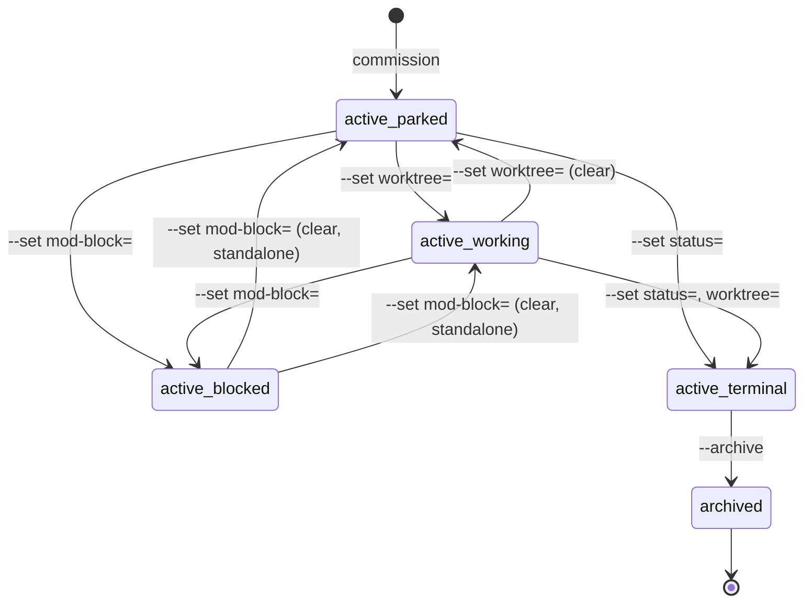
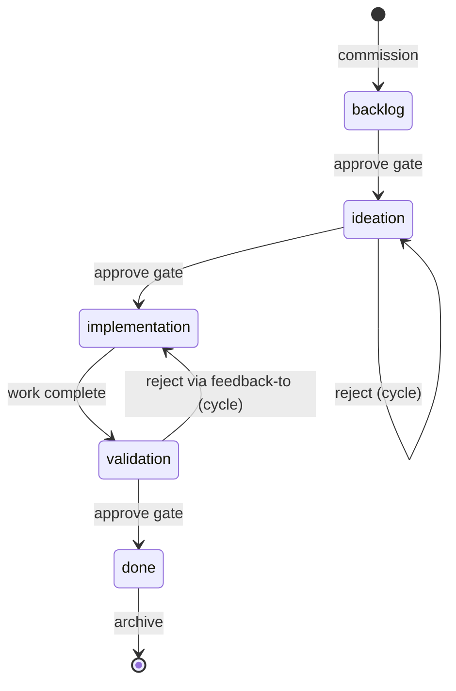

# Spacedock Frontmatter & State Machine — Contract Spec (v0 draft)

**Status:** v0 draft. TBDs and holes called out inline; not yet wired to mdschema YAML.
**Date:** 2026-05-12.
**Companion docs:** `2026-05-12-spacedock-go-port-design.md` (foundational decisions), `2026-05-12-spacedock-go-port-roadmap.md` (sub-project decomposition).
**Source materials:** `gf-spec/raw/synthesis/api/05-workflow-files.md`, `gf-spec/raw/specs/modules/state-mutation-and-guards.md`, current implementation (`skills/commission/bin/status`, `skills/commission/bin/claude-team`, `skills/commission/SKILL.md`).

## Purpose

This is the canonical data contract for spacedock workflows. It describes what valid workflow data looks like (shape), what each field means operationally (semantics), and what transitions and invariants the system enforces (state machine). The Go binary port reads/writes against this contract; the existing Python implementation (`skills/commission/bin/status`) is the equivalence oracle until the port stabilizes.

## Scope

**In scope:**
- Workflow directory layout (flat + folder entities, `_archive/`, `_mods/`).
- README.md frontmatter — fields, types, semantics.
- Entity frontmatter — canonical fields, custom-field policy, parser semantics.
- State machine — stages, transitions, guards, side effects.
- Invariants the data layer enforces.
- Stage Report body conventions (ensign output).
- Cross-references to mdschema YAML files (TBD — produced in sub-project #1's implementation step).
- Versioning + backward compatibility policy.

**Out of scope:**
- The FO operating contract (lives in `skills/first-officer/references/`).
- The ensign operating contract (lives in `skills/ensign/references/`).
- Mod hook semantics beyond what touches entity state (`pr`, `mod-block`).
- Go binary's package structure (sub-projects #3, #4, #5).
- LSP editor convenience (deferred from v0).

## Data Model Overview

Two primary objects:

- **Workflow** — described by a `README.md` plus the directory it lives in. Defines the entity type, the stages an entity moves through, and the lifecycle hooks (mods).
- **Entity** — instance of the workflow's entity type. Each is a markdown file (`<slug>.md`) or a folder (`<slug>/index.md`) with YAML frontmatter plus a markdown body.

A workflow contains:
- Exactly one `README.md` at the directory root.
- Zero or more entities (active).
- An `_archive/` subdirectory for terminal entities.
- An `_mods/` subdirectory for lifecycle hook templates and standing teammate declarations.
- Optionally `_debriefs/` for session records.

An entity contains:
- Frontmatter (YAML between `---` delimiters) — recognized canonical fields plus arbitrary custom fields.
- Body (markdown) — opens with a problem-statement paragraph; may contain `## Acceptance criteria`, `## Test plan`, `## Stage Report: <stage>` (one per stage cycle), `### Feedback Cycles` (FO-owned).
- Optionally an associated worktree path (when the entity is in a worktree-backed stage); during that time, the active copy lives at `<git-root>/<worktree>/<rel-path>`, with the canonical copy at workflow root mirroring only `pr:`.

## Workflow Directory Layout

```
{workflow_dir}/
├── README.md                    — workflow definition (canonical schema source)
├── <slug>.md                    — flat entity (default form)
├── <slug>/                      — folder entity (alternative)
│   └── index.md
├── _archive/                    — archived entities
│   └── <slug>.md or <slug>/
├── _mods/                       — lifecycle hook templates + standing teammates
│   └── <name>.md
└── _debriefs/                   — session debriefs (optional)
    └── YYYY-MM-DD-NN.md
```

Rules (ported from gf-spec `API-WF-LAYOUT-001..005`):

1. **Two entity forms coexist.** An entity is either a flat file `<slug>.md` directly in the workflow directory, or a folder `<slug>/` containing an `index.md`. Both are first-class.
2. **Folder wins on conflict.** When the same slug exists both as flat and folder, the folder form takes precedence; the implementation emits a stderr warning instructing the operator to remove the flat file.
3. **`_archive/` and `_mods/` are reserved.** They are never treated as entity folders during discovery.
4. **Hidden entries are skipped.** Hidden directories (names beginning with `.`) and hidden flat-file `.md` entries are skipped during discovery. The top-level `README.md` is also skipped (it is the workflow definition, not an entity).
5. **Debriefs convention.** `_debriefs/{date}-{sequence:02d}.md` is the convention for session debriefs (`mkdir -p` on demand).

## README.md Frontmatter

The workflow's `README.md` carries YAML frontmatter delimited by `---` lines.

### Identity fields

| Field | Type | Required | Semantics |
|-------|------|----------|-----------|
| `commissioned-by` | string | yes | Format `spacedock@<version>` (e.g. `spacedock@0.11.1`). Also accepts bare `spacedock@`. Stamps the spacedock version that authored this workflow. |
| `entity-type` | string | yes | snake_case form of the entity description. |
| `entity-label` | string | yes | Singular label (e.g. `task`, `idea`). |
| `entity-label-plural` | string | yes | Plural label (e.g. `tasks`, `ideas`). |
| `id-style` | string | yes | Default `sequential`. Allowed values: `sequential` (zero-padded integers from `001`), `sd-b32` (Spacedock Base32 SHA-derived 24-char IDs with short prefixes), `slug` (identity = slug; no separate `id` field on entities). |
| `mission` | string | optional | Mission statement (also rendered in body). |

### Stages block

The `stages:` mapping has two child keys: `defaults:` (fallback values) and `states:` (ordered list of stage entries). Optionally a `transitions:` block declares non-linear edges.

| Field | Type | Default |
|-------|------|---------|
| `stages.defaults.worktree` | boolean | `false` |
| `stages.defaults.concurrency` | integer | `2` |
| `stages.defaults.model` | string | absent |
| `stages.states[].name` | string | required |
| `stages.states[].initial` | boolean | `false` (true on first stage only) |
| `stages.states[].terminal` | boolean | `false` (true on last stage only) |
| `stages.states[].worktree` | boolean | inherits `defaults.worktree` |
| `stages.states[].concurrency` | integer | inherits `defaults.concurrency` |
| `stages.states[].gate` | boolean | `false`. When true, transitions out of this stage require captain approval. |
| `stages.states[].fresh` | boolean | absent. When true, the stage disables worker reuse — a fresh agent dispatches each time. |
| `stages.states[].feedback-to` | string | absent. Target stage name when this stage rejects. |
| `stages.states[].agent` | string | absent (defaults to `ensign`). |
| `stages.states[].model` | string | absent. Must be in enum `(sonnet, opus, haiku)` if declared. |

Stage rules:

- Each stage entry begins with `- name: <stage name>`; subsequent same-indent `key: value` pairs attach to that entry.
- A stage marked `terminal: true` MUST be the last stage; a stage marked `initial: true` MUST be the first stage.
- Per-stage entries are added only when they override defaults — generated workflows omit fields that match defaults.
- When a stage's `model` field is declared, it MUST be in `(sonnet, opus, haiku)`. Validation also applies to `stages.defaults.model`. Mismatches reject `claude-team build`.
- Stage order is the position in the declared list (one-based). Unrecognized statuses on entities sort to the bottom (sentinel order 99).

### `stages.transitions` (optional, non-linear flows)

For linear workflows, `transitions:` is omitted entirely. It is added only for non-linear flows, with explicit `from`/`to`/`label` edges.

### Per-stage README subsection

Each stage in `stages.states` MUST have a corresponding `### \`{stage_name}\`` subsection in the README body containing:

- One-sentence description (who sets the status, what being in this stage means).
- `Inputs:` bullet — what the worker reads.
- `Outputs:` bullet — what the worker produces (becomes per-dispatch checklist items).
- `Good:` bullet — quality criteria.
- `Bad:` bullet — anti-patterns.

Stage-subsection rules:

- The heading may be backtick-wrapped (`` ### `work` ``) or bare (`### work`), with optional parenthetical annotation like `### \`triaged\` (terminal)` (informational; frontmatter is canonical).
- The subsection ends at the next `### ` or `## ` heading or end-of-file.
- Stage `Outputs:` bullets become per-dispatch checklist items at dispatch time. Entity-level acceptance criteria belong in the entity body's `## Acceptance criteria` section, NOT in any stage's Outputs.
- A stage declared in YAML but lacking its `### {stage}` heading causes `claude-team build` to reject with `stage '{stage}' heading not found in {readme_path}`.

**TBD:** which of the four bullets (`Inputs:`, `Outputs:`, `Good:`, `Bad:`) are strictly required vs convention. Today the implementation requires `Outputs:` to extract checklist items but does not enforce the others. Should the spec be strict (all four required) or convention-only?

## Entity Frontmatter

Per-entity `.md` files (or `<slug>/index.md`) carry YAML frontmatter delimited by `---` lines.

### Canonical fields

| Field | Type | Always-present | Semantics |
|-------|------|----------------|-----------|
| `id` | string | yes (default empty) | For `id-style: sequential`: a non-negative integer rendered as zero-padded string. For `id-style: sd-b32`: a 24-character Spacedock-Base32 ID. For `id-style: slug`: typically empty (slug carries identity). |
| `title` | string | yes (default empty) | Short human label; rendered in status table TITLE column. |
| `status` | string | yes (default empty) | Current stage name; MUST match a `stages.states[].name`. Unrecognized values sort to bottom (sentinel order 99). |
| `score` | numeric string | yes (default empty) | Sort tiebreaker; higher first within a stage; empty sorts last; non-numeric coerced to zero. |
| `source` | string | yes (default empty) | Free-form provenance. Rightmost default column in `status` table. |
| `worktree` | string | yes (default empty) | When non-empty, names a worktree path relative to git root; also marks the entity as "actively worked." See worktree-aware reading rules. |
| `pr` | string | optional | GitHub PR reference (with or without leading `#`). Used by `--boot` PR_STATE display and PR-mirror logic. |
| `started` | ISO 8601 string | optional | Set when the entity first enters non-initial stage. Auto-fillable via `--set <slug> started` (bare form). |
| `completed` | ISO 8601 string | optional | Set when the entity reaches terminal status. Auto-fillable via `--set <slug> completed`. |
| `verdict` | string | optional | Set at terminal stage. Conventional values: `PASSED`, `REJECTED`. |
| `mod-block` | string | optional | When non-empty, blocks terminal updates and archival (mod hook in flight). Format convention: `<lifecycle_point>:<mod_name>`, e.g., `merge:pr-merge`. |
| `archived` | ISO 8601 string | written by `--archive` | Stamp added during archival. |
| `issue` | string | optional | GitHub issue cross-reference (e.g., `#42` or `owner/repo#42`). |
| Custom keys | string | optional | Arbitrary additional keys are preserved on the entity dict; passed through `--where` filters and `--all-fields` columns. |

### Canonical-fields seed rule

When a new entity is seeded, the keys `id`, `status`, `title`, `score`, `source`, `worktree` are guaranteed present (defaulting to empty). Other canonical keys are present only when the file declares them.

### Custom-field policy

**Strict on canonical fields, permissive on additions.** The schema enforces type/format on canonical fields. Unknown fields are preserved and surfaced through `--where` and `--all-fields` without rejection. Workflow authors and captains add their own metadata fields (`cost`, `owner`, `deadline`, etc.) without schema gymnastics.

**TBD:** reserved namespaces or prefixes for custom fields to prevent future canonical-field conflicts (e.g., reserve `x-*` for captain-added fields).

### Parser semantics

(Ported from gf-spec `API-WF-FRONTMATTER-001..006`.)

1. **Colon-split rule.** Every line between the two `---` delimiters that contains a colon is split on the first colon into key (trimmed) and value (trimmed).
2. **Top-level-only.** Lines whose first character is whitespace are NOT added as top-level keys (treated as nested content and ignored). Nested YAML structures (lists, maps under indentation) are not interpreted.
3. **Quote stripping.** Surrounding matching single or double quotes (when both ends use the same quote AND the value is at least 2 chars) are stripped. Other quoting forms are not unwrapped.
4. **Empty values.** A line of the form `key:` with nothing after the colon yields an empty-string value. Empty values render as a blank cell — never as `-`, `0`, or the field name.
5. **Second-delimiter halts parsing.** When the closing `---` is parsed, parsing stops; content after it is ignored.
6. **No quoting on write.** `update_frontmatter` does not preserve quoting/escaping. A value containing colon, leading whitespace, or YAML special characters (`#`, `&`, `*`, `[`, `{`, etc.) is written verbatim, which can produce invalid YAML on re-parse. There is no validation on write.

**TBD:** the Go port should harden parser semantics. Decide whether to keep the line-oriented hand-rolled parser (which has gone through real bug fixes around inline YAML comments and fence detection) or move to a real YAML library (Go's `gopkg.in/yaml.v3`). Trade-off: full YAML support vs preserving observed-quirk parity. Likely answer: keep line-oriented for write-path (to preserve exact frontmatter formatting on commits) and use full YAML on read-path.

### Worktree-aware reading

(Ported from gf-spec `API-WF-WT-001..004`.)

1. **Active copy path.** When an entity has a non-empty `worktree` field, the active copy lives at `<git-root>/<worktree>/<workflow-relative-path>`. For flat entities: `<git-root>/<worktree>/<slug>.md`; for folder entities: `<git-root>/<worktree>/<slug>/index.md`.
2. **Silent fallback.** When the worktree mirror file does not exist, reads silently fall back to the canonical workflow-directory copy.
3. **Overlay semantics.** When loading a worktree-backed entity's fields, the canonical-copy frontmatter is overlaid by the active-copy frontmatter (active wins; canonical-only fields preserved).
4. **`pr:` mirrors to canonical.** `--set` mirrors `pr` updates back to the main entity file so PR metadata stays discoverable from the workflow root. All other fields stay on the worktree copy.

## State Machine

The entity lifecycle is modeled as a state machine with two layers:

- **Macro-state** — where the entity lives (active in workflow dir / archived in `_archive/`) and whether it's blocked or terminal.
- **Stage** — what stage the entity is at within active, via the `status` field. Stages are workflow-defined.

### Macro-state diagram



- `active_parked`: entity exists in workflow directory; `worktree` empty; `status` may be any stage.
- `active_working`: entity exists; `worktree` non-empty; `status` is a worktree-backed stage.
- `active_blocked`: `mod-block` non-empty. Guards prevent terminal advancement.
- `active_terminal`: `status` is the terminal stage; `completed` set; `verdict` set; still in workflow directory.
- `archived`: moved to `_archive/<slug>.md` (or `_archive/<slug>/index.md`); `archived` stamp added.

### Stage transitions (workflow-defined)

The default 5-stage shape (per `skills/commission/SKILL.md`'s workflow template) is:



Actual workflows define their own stages; this is illustrative.

### Transition guards

| Transition | Guard | Source / cite |
|------------|-------|---------------|
| Any → status=terminal | `mod-block` MUST be empty (or `--force`). | `status:1530-1551` |
| Any → status=terminal | If workflow registers merge hooks: `pr` non-empty OR `mod-block` non-empty (or `--force`). The mechanism enforces this regardless of whether the FO sets `mod-block` first — if hooks exist and both are empty, the hook has provably not run. | `status:1542-1557` |
| Clear `mod-block` + set terminal in same `--set` | REFUSED. Two-step audit rule: the clear and the terminalize must be separate commits. `--force` bypasses. | `status:1226-1239` |
| `--archive <slug>` | `status` MUST be terminal. The archive command does not advance status; it moves a terminal entity to `_archive/`. | `status:_archive` flow |
| Set `worktree=<path>` | No guard at the data layer (FO discipline enforces "first worktree-dispatch sets this"). | — |

### Side-effects per transition

| Transition | Side effect | Source / cite |
|------------|-------------|---------------|
| `--set <slug> field=value` | Writes `field: value` to entity frontmatter (overlay to worktree copy when `worktree` set, except `pr:` which mirrors to canonical). | `status:1604-1611` |
| `--set <slug> started` (bare) | Auto-fills `started: <ISO 8601 UTC>` if currently empty; no-op if already set. | `status:1113` |
| `--set <slug> completed` (bare) | Same as `started`, for `completed`. | `status:1113` |
| `--archive <slug>` | Stamps `archived: <ISO 8601 UTC>`, then renames the entity (flat file) or directory (folder form) to `_archive/`. | `status:1255-1257` |
| `pr=` update | Always mirrored back to canonical workflow-dir copy even if the entity is worktree-backed (so `--boot` PR_STATE can see the PR from the workflow root). | `status:1604-1611` |
| Mod-block transitions | The mod-block field is operator-managed (FO sets it before invoking a mod hook; clears it after the hook completes). The data layer enforces the two-step audit rule; the lifecycle around the field is FO/mod concern. | shared-core |

### Mutation mechanics

- The frontmatter rewriter performs a single read followed by a single write — no temp file, no advisory lock, no fsync, no rollback.
- The CLI does not invoke git. Commits are the caller's responsibility (FO on main; ensign on the worktree branch).
- Output contract on success: `field: <old> -> <new>` per mutated field on stdout. Archive prints `archived: <destination>`.
- Exit codes: 0 on success, 1 on refusal or error. Errors and warnings go to stderr.

## Invariants

These hold for the data layer at rest. Drift indicates a bug.

1. **ID uniqueness.** Per `id-style`:
   - `sequential` — `id` values are unique non-negative integers across active + archived.
   - `sd-b32` — full 24-character stored IDs are unique across active + archived; status display computes the shortest unique prefix.
   - `slug` — slugs are unique across active + archived (id field is unused).
2. **Slug uniqueness.** Slugs unique across active + archived. The slug is the canonical entity reference (file name stem for flat entities, directory name for folder entities).
3. **Initial-stage cardinality.** Exactly one stage in `stages.states[]` has `initial: true`, and it's the first one in the list. If absent on every stage, the first list entry is treated as initial.
4. **Terminal-stage cardinality.** Exactly one stage has `terminal: true`, and it's the last one. (Multi-terminal workflows are not currently supported.)
5. **Mod-block guard.** While `mod-block` is non-empty, no transition to a terminal stage is permitted without `--force`.
6. **Merge-hook invariant.** When the workflow registers any merge hook (any `_mods/*.md` with `## Hook: merge`), AND `pr` is empty, AND `mod-block` is empty, the data layer refuses terminal advancement regardless of FO discipline. This catches the FO forgetting to set `mod-block` before invoking the hook.
7. **Two-step audit.** Clearing `mod-block` and advancing to terminal CANNOT happen in a single `--set` invocation. The audit history must show them as separate commits. `--force` bypasses.
8. **Worktree liveness.** If `worktree` is non-empty, the worktree path may or may not exist on disk. If it doesn't, reads silently fall back to canonical. Writes still target the worktree path; missing path is created. There's no hard requirement that worktree-path-exists at the data layer.
9. **Status enum.** `status` value SHOULD match a `stages.states[].name`. Unrecognized values don't reject but sort to bottom (sentinel order 99) — a visible "this entity is misnamed" signal.
10. **`pr` mirror.** When `pr` is written to a worktree-backed entity, the canonical copy in the workflow directory is also updated. No other field mirrors.

## Stage Report Body Convention

Workers (ensigns) append a `## Stage Report: <stage_name>` section at the END of the entity body when they complete work. The FO reads the LAST such section as the canonical report.

### Structure

```
## Stage Report: <stage_name>

DONE: <item text> — <one-line evidence>
SKIPPED: <item text> — <one-line rationale>
FAILED: <item text> — <one-line concrete details>
...

### Summary
<2-3 sentences covering what was done, key decisions, anything notable>
```

### Rules

- Top-level heading: `## Stage Report: {stage_name}`.
- Each item line uses one of three prefixes — `DONE:`, `SKIPPED:`, `FAILED:` — followed by the checklist item text (verbatim where possible) and one-line evidence/rationale/details.
- Stage reports SHOULD be 30-50 lines maximum, with one-line evidence per checklist item. Reports MUST NOT paste before/after diffs (the git log is the diff) or full test output (`5/5 passed` is sufficient).
- Every dispatched checklist item MUST appear in the stage report. Markdown checkbox markers are NOT used.
- The `### Summary` is 2-3 sentences.
- When redoing a stage after rejection, the ensign appends a NEW `## Stage Report: {stage_name} (cycle N)` section at the end rather than overwriting the prior report. The latest report is always the LAST one in the file.
- The ensign appends at end-of-file — it does NOT read the entity body to find an insertion point.

**TBD:** should the spec validate Stage Report structure (mdschema body rules) or leave it as ensign-side prose convention? Argument for spec validation: catches malformed reports at write-time, prevents FO confusion when reading. Argument against: ensign discipline is captured in the ensign skill's prose; spec-validating here duplicates the contract.

## Entity Write-Scope

(Cross-references the FO and ensign contracts; included here for completeness.)

- The FO owns YAML frontmatter on the main branch. Frontmatter mutations go through `status --set`.
- For worktree-backed entities, active stage/status/report/body state lives in the worktree copy. Only `pr:` is mirrored on `main`.
- The ensign updates entity body, NOT frontmatter.
- The FO MUST NOT edit code files, test files, mod files, or scaffolding files directly on main. All such changes go through a dispatched worker in a worktree.

## File-Naming Conventions

- Slugs are lowercase + hyphens, no spaces, no other punctuation. The slug derives from the title by lowercasing, hyphenating spaces, stripping non-alphanumeric (other than hyphen) chars.
- Sequential entity IDs start at `001`, zero-padded to 3 digits. The next ID is `(maximum existing numeric id) + 1` across both active and archived entities.
- Stage names: lowercase with hyphens (`^[a-z0-9][a-z0-9-]*[a-z0-9]$`). Enforced at `status --validate` time. Used directly as the `Agent()` description suffix (via `claude-team build`), so anything outside this regex causes downstream dispatch failures.

## Shape (machine-checkable artifacts — TBD)

The following mdschema YAML files will live under `schemas/` at the repo root:

- `schemas/workflow-readme.mdschema.yml` — README frontmatter shape, body-structure rules (stage subsections + body sections).
- `schemas/entity.mdschema.yml` — entity frontmatter shape (strict on canonical, permissive on additions), body-structure rules for `## Acceptance criteria`, `## Stage Report: ...`, `### Feedback Cycles` sections.

**Authoring path:** run `mdschema derive` against the existing `docs/plans/*.md` and `_archive/*.md` corpus; hand-refine against the canonical contract above; diff the two to surface contract gaps vs accidental conventions.

**TBD:** the YAML files themselves. Not authored yet — sub-project #1's implementation step.

## Versioning + Backward Compat

- Schema files carry a `version:` field matching the spacedock binary version they were authored against (e.g., `version: 0.12.0`).
- Workflows advertise their authoring version via `commissioned-by: spacedock@<version>` in `README.md` frontmatter.
- New schema versions MUST validate older-spacedock-written workflows unchanged, except for deliberately-deprecated fields (which get a deprecation period before removal).
- Breaking changes → schema major-version bump.
- The Go binary should accept any workflow whose `commissioned-by` advertises a version ≤ binary version, and refuse (with a clear error) any workflow advertising a newer-than-binary version.

**TBD:** specific per-version migration rules. v0 of this spec assumes monotonic forward-compatibility (no field removals, only additions, until major-version bump). Real migration logic kicks in if/when we break that.

## Open Questions / TBDs Catalog

Collected from inline TBDs above for tracking:

1. Stage subsection bullets: which of `Inputs/Outputs/Good/Bad` are strict-required vs convention.
2. Reserved namespaces for custom entity fields (e.g., `x-*` prefix).
3. Frontmatter parser hardening: line-oriented vs full YAML on read-path.
4. mdschema YAML files: authored in implementation step.
5. Stage Report body: spec-validated or prose-convention.
6. Per-version migration rules beyond monotonic additive.

## What Lives Elsewhere (Cross-References)

- FO operating contract: `skills/first-officer/references/first-officer-shared-core.md` (post-`0f` includes the `## Gate Presentation` section).
- FO Claude runtime: `skills/first-officer/references/claude-first-officer-runtime.md`.
- FO Codex runtime: `skills/first-officer/references/codex-first-officer-runtime.md`.
- Ensign operating contract: `skills/ensign/references/ensign-shared-core.md`.
- Commission flow: `skills/commission/SKILL.md`.
- Mod hook semantics: `skills/first-officer/references/first-officer-shared-core.md` `## Mod Hook Convention` + each `_mods/*.md`.
- gf-spec source captures: `gf-spec/raw/synthesis/api/05-workflow-files.md`, `gf-spec/raw/specs/modules/{frontmatter-and-discovery-substrate,state-mutation-and-guards,workflow-schema-and-commission}.md`.
