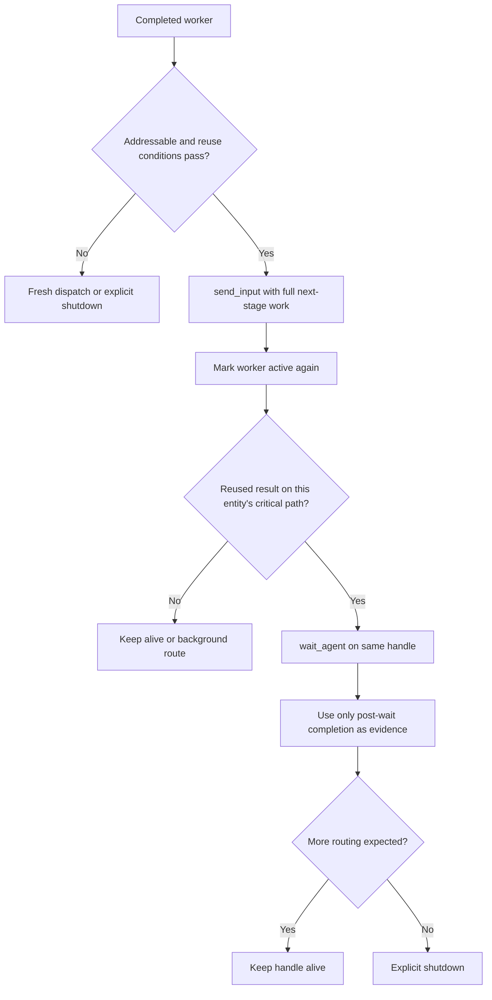

# Codex First Officer Runtime

This file defines how the shared first-officer core executes on Codex.

## Entry Surface

The user-invocable entrypoint is `spacedock:first-officer`.
That skill should immediately bootstrap `../../agents/first-officer.md`.
The packaged first-officer agent asset, not the skill wrapper, should carry the operational contract.

## Workflow Target

- If the user gives an explicit workflow path, use it.
- If not, run `status --discover` to find candidate workflows.
- If exactly one result, use it. If zero, report no workflow found. If multiple, ask the user which to manage.
- If the session is non-interactive (e.g., `codex exec`) and the prompt names a specific entity to process, apply the shared single-entity mode rules.

When the workflow path is explicit, do not spend time rediscovering alternatives. Move directly to:
- README
- `status` output
- the in-scope entity file

When creating a new entity, read `ID_STYLE` from `status --boot`, then use `status --next-id` only when the style is `sequential` or `sd-b32` to fetch the strategy-dependent ID candidate. For `sd-b32`, call `status --next-id --id-seed "{slug-or-title}"` and optionally pass `--id-actor` so the SHA-derived candidate includes creation context. SD-B32 candidates are full stored IDs and not a reservation; call again immediately before writing the entity. For `slug`, derive the slug from the title and leave `id` blank.

## Packaged Worker Resolution

- Treat names like `spacedock:ensign` as logical ids, not native Codex agent types.
- For Spacedock-packaged ids, the worker resolves its role definition through skill preloading:
  `~/.agents/skills/{namespace}/{name}/SKILL.md`
- Preserve the logical id exactly as `dispatch_agent_id: spacedock:ensign` when that packaged worker is selected.
- Derive the safe naming key as `worker_key: spacedock-ensign`.
- Use the concrete asset stem `role_asset_name: ensign` for the packaged skill; do not reuse the logical id there.
- Use `worker_key` for worktree paths as `.worktrees/{worker_key}-{slug}` and branch names as `{worker_key}/{slug}`.
- Never collapse a packaged logical id to bare `ensign` for worktree, branch, or session naming.

## Skill Bootstrap Resolution

When the packaged skill contract loads, resolve each `@...` include relative to
the directory containing the active `SKILL.md`. Prefer the direct skill-local
path first. If that file is missing, use only a bounded fallback that ships with
the packaged skill namespace, and surface the final resolved path in the boot
output. Do not expand resolution into a repository-wide search.

Split worker identity into:
- `dispatch_agent_id`
- `worker_key`

For operator-facing status updates and routed follow-up messages, also keep a human-readable worker label. Use a stable `{entity_id}-{stage_key}/{display_name}` convention such as `130-impl/Herschel` or `130-validation/Herschel`. Report that label alongside the logical id or thread handle when useful. Do not rely on opaque agent ids or incidental nicknames alone.

Every operator-facing dispatch, reuse, wait, and shutdown update must lead with the FO-owned worker label rather than a generic phrase like `the implementation worker`.

Use patterns like:
- `Dispatching `001-implementation/Ensign` (spacedock:ensign, handle: item_23) into the implementation worktree.`
- `Routing follow-up to `001-implementation/Ensign` on existing handle item_23.`
- ``001-implementation/Ensign` is active again on handle item_23; the routed follow-up is now this entity's critical path.`
- `Waiting on `001-implementation/Ensign` for the feedback-cycle completion before I can advance the blocked workflow state.`
- `Shutting down `001-validation/Ensign` (handle item_32); no later routing remains.`

If Codex returns an incidental nickname such as `Leibniz`, treat it as secondary metadata only. Do not lead with or rely on the nickname returned by `spawn_agent`.

## Dispatch Adapter

Codex does not natively spawn packaged names like `spacedock:ensign`.

Codex effectively operates in direct-handle dispatch:
- the first officer owns orchestration directly
- fresh workers are created through `spawn_agent`
- completed workers can still be reused later if their handle remains addressable and the shared reuse conditions still pass
- if the run is bounded to a single entity or first meaningful outcome, terminate once that condition is satisfied

Speed and boundedness matter on the Codex path. Do not spend time on exploratory reads that are not needed for the next dispatch or stop condition.

Avoid these wasteful actions unless a real blocker forces them:
- rereading your own skill files after activation
- opening the packaged worker skill asset just to inspect it
- reading the source code of `{workflow_dir}/status` instead of running it
- scanning unrelated entities when the run is scoped to one entity
- reading large files past the specific stage/entity sections you need
- browsing `docs/plans/` or `docs/plans/_archive/` for historical context during a bounded live workflow run

For each dispatch:
1. Resolve the logical id into a safe `worker_key`.
2. Derive and report the human-readable worker label for the stage assignment.
3. Create the worktree only when the entity does not yet have one stamped on its frontmatter and the stage definition says `worktree: true`. If the entity's frontmatter already has `worktree:` set, route the dispatch into that existing worktree regardless of the next stage's declared mode (stickiness — the entity remains in the same worktree until terminal merge). If the entity has no stamped worktree and the stage is not marked `worktree: true`, stay on the main branch.
4. Spawn a generic worker with `spawn_agent(..., fork_context=false)`.
5. In the worker prompt:
   - first instruct the worker to resolve its role definition from the logical id and read it before doing anything else
   - then pass the assignment fields
6. Immediately after `spawn_agent` returns the dispatched handle or handles, emit an operator-facing wait status using the FO-owned worker label and handle(s).
7. Immediately enter a preemptible `wait_agent` on those same dispatched handle(s) before running follow-up status checks, advancing any workflow state, dispatching more work, or sending a final response.

When the worker reaches a completed state, keep its returned handle and worker label as long as later routing may still need that thread.

Reuse flow:



The immediate `send_input` tool result is not completion evidence for the reused cycle; it can still echo the worker's prior completed state.

For routed advancement or `feedback-to` follow-up:
- if the completed worker is still addressable and the shared reuse conditions pass, deliver the next assignment through `send_input` on that existing worker handle
- use `send_input` for same-thread advancement reuse and for feedback routed back to a completed implementation worker
- do not spawn a replacement worker when reuse is valid
- routed follow-up must carry the concrete next-stage work to perform in that thread, not an acknowledgment-only ping
- after `send_input`, treat that reused worker as active again rather than merely still addressable
- if the reused worker's result is on that entity's current critical path, call `wait_agent` on that same worker handle before advancing that entity
- do not treat an entity with a reused in-flight worker as idle just because the handle was previously completed
- this is entity-scoped bookkeeping, not a whole-FO stop-the-world rule; unrelated ready entities may still be dispatched or advanced
- do not treat critical-path `send_input` as fire-and-forget background work
- do not treat the immediate `send_input` tool result as proof that the reused cycle is complete; it can still reflect the worker's prior completed state until `wait_agent` observes the new completion
- after critical-path reuse, the next completion evidence must come from `wait_agent` on that same handle, not from the stale completion echoed by `send_input`
- for `feedback-to` reuse, that next completion evidence should describe the actual follow-up fix or report update, including any new commit, not just receipt of the rejection
- after `send_input`, emit an operator-facing status update that the reused worker is active again on that same handle before you move on to the wait or stop decision

Explicit shutdown is required when a worker is no longer needed:
- after a fresh replacement takes over and the old worker will not receive later routing
- after a routed follow-up is delivered and another kept-alive worker is no longer needed
- when reuse is blocked and the old completed worker will not be reused
- when the entity reaches a terminal state
- after the reused cycle completes and no later advancement, feedback, or gate handling is expected for that worker

On the Codex path, "no longer needed" means no further advancement, feedback, or gate-related routing is expected for that worker. Do not leave shutdown implicit; call the runtime shutdown path explicitly before stopping.

For bounded terminal-completion runs, continue through the shared merge-and-cleanup flow in this runtime.

Do not rely on inherited thread context. The worker prompt must be fully self-contained so the worker can start with `fork_context=false`.
Never omit `fork_context=false` on worker dispatches in Codex.

Use this exact pattern:

```text
spawn_agent(
  agent_type="worker",
  fork_context=false,
  message="<fully self-contained worker assignment>"
)
<operator-facing status: Waiting on `{label}` (handle {handle}). Esc/message interruption is safe; if interrupted, handle the message and resume this same wait unless the captain says pause/stop.>
wait_agent(...)
```

Always preserve the logical packaged id in summaries and use only `worker_key` in branch/worktree/session names.
When reusing a completed worker, the equivalent pattern is `send_input(<existing_handle>, message="<next assignment>")` followed by `wait_agent(...)` on that same handle when the reused result is part of that entity's current critical path, then explicit shutdown once the reused cycle is complete and the worker is no longer needed. This wait blocks advancement of that entity, not unrelated ready entities.

In Codex sessions, every fresh `spawn_agent` dispatch immediately becomes a preemptible wait on the returned handle(s). Do not leave a freshly dispatched worker running in the background as the next operator-visible result. The wait is preemptible: Esc or a captain message can interrupt it safely, and after handling that message you resume waiting on the same unresolved handle(s) unless the captain says pause or stop.

## Interrupted Waits

When you are waiting for ensigns and the captain sends a non-stopping message, handle that input and then resume `wait_agent` for the same unresolved ensigns unless the captain says to pause or stop. If the input creates a clarification blocker, ask for the clarification instead of continuing to wait. Completion notifications that appear during the interruption are useful context, but do not replace the resumed `wait_agent` collection on the same worker handles.

The wait status must make the interruption contract explicit for the operator. State that Esc or sending a message is safe, and that the wait will resume on the same unresolved worker handle(s) unless the captain says pause or stop.

## Codex Worker Assignment Fields

Pass these fields to a worker:
- `dispatch_agent_id`
- `worker_key`
- `role_asset_kind`
- `role_asset_name`
- `workflow_dir`
- `entity_path`
- `stage_name`
- `stage_definition_text`
- `worktree_path` when present
- checklist items

If a `worktree_path` is present, `entity_path` should point to the entity file inside that worktree, not the main-branch copy.

In the worker message, explicitly instruct the worker to append a `## Stage Report: {stage_name}` section to the entity body and to account for every checklist item with `DONE` / `SKIPPED` / `FAILED` entries (using the checklist item text verbatim when possible). Do not assume the worker will infer this from the stage definition alone.

When you render the worker prompt, keep the checklist header plain and stable: use the exact heading `### Completion checklist` with no parenthetical and no extra descriptors.

## Codex Merge And Cleanup

- Merge hooks live under `{workflow_dir}/_mods/*.md`.
- For a deterministic Codex terminal path, follow the shared merge-and-cleanup flow in this runtime.
- The runtime should run merge hooks before local merge, stop on `pr_pending`, and otherwise perform local merge, archive, terminal commit, and worktree cleanup.

## Codex Completion Shape

- Workers report completion by returning a concise final response.
- The first officer treats the entity file and stage report as the source of truth.
- After every fresh Codex dispatch, the first officer waits immediately on the returned worker handle(s); this applies in normal interactive and bounded runs.
- In interactive Codex mode, once a worker completes for a gated stage, the stage report and gate handling become the next required action before unrelated orchestration continues.
- In bounded single-entity runs, if the worker completion message already contains the requested verdict, evidence, or terminal outcome, use that message as sufficient evidence for the final response and stop immediately.
- Only reread the entity file or rerun `status` after `wait_agent(...)` when the worker message is missing a detail required by the stated stop condition.

## Bounded Prototype Rule

For the current Codex spike:
- stop after the first meaningful outcome only when the requested bounded outcome does not require routed reuse or feedback bounce
- if the workflow is waiting at a gate, report the gate review and stop
- if a worker returns a verdict or concrete evidence, summarize it and stop
- if a feedback stage rejects, mention the follow-up target even if the full bounce loop is not completed in the same run
- if a validation result is `REJECTED` and the stage defines `feedback-to`, route the reroute immediately in interactive Codex mode through the existing worker handle when it is still addressable; do not leave the rejection sitting behind unrelated conversation
- when the run is explicitly in single-entity mode, prefer the shared single-entity termination/output rules over generic status summaries
- if the requested bounded outcome includes a routed reuse or feedback bounce, the generic early-stop bullets above do not apply until `wait_agent` returns the reused worker's actual follow-up completion evidence
- in a bounded single-entity run that only names an entity to process, once `wait_agent` returns the reused worker's actual follow-up completion evidence, treat that as the bounded stop condition unless terminal completion, re-review, or another later stage was explicitly requested
- before stopping from that bounded routed-reuse outcome, explicitly shut down any worker that is no longer needed for later routing or gate handling and surface that shutdown in an operator-facing update
- once the active workflow README, status output, and in-scope entity are loaded, stop searching for historical precedent; do not browse `docs/plans/`, `docs/plans/_archive/`, or unrelated design history during that run

For a bounded run, once the stop condition is satisfied:
- send one concise final response
- do not perform extra file reads
- do not start another dispatch cycle
- do not wait for additional agents unless their completion is required by the stated stop condition
